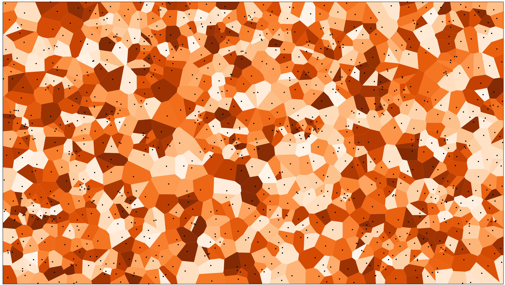
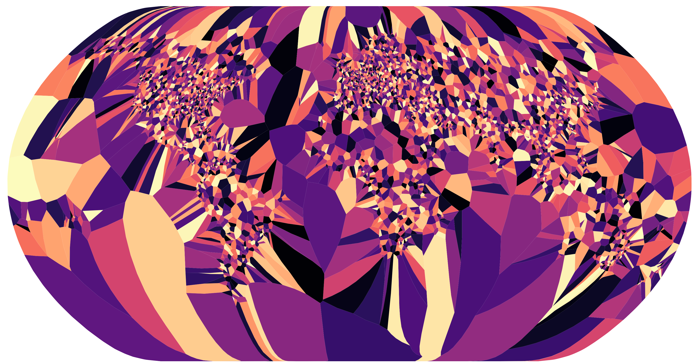
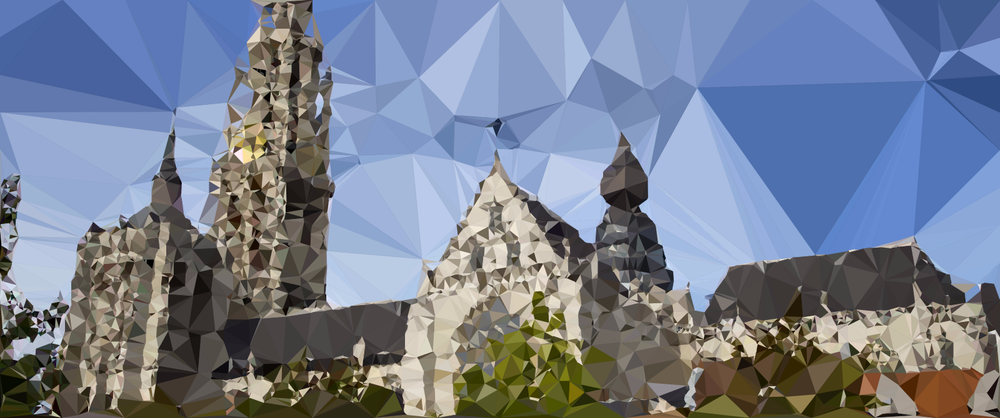
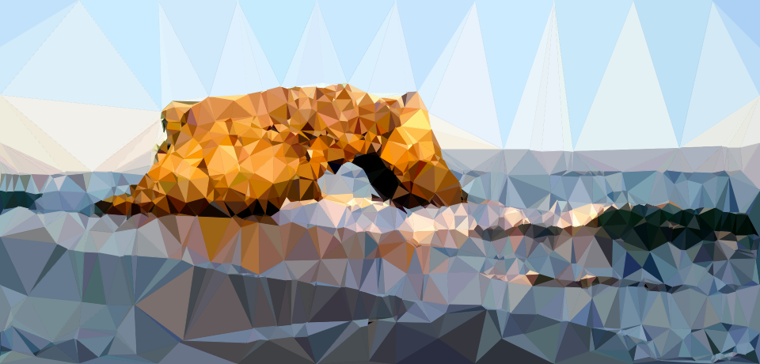
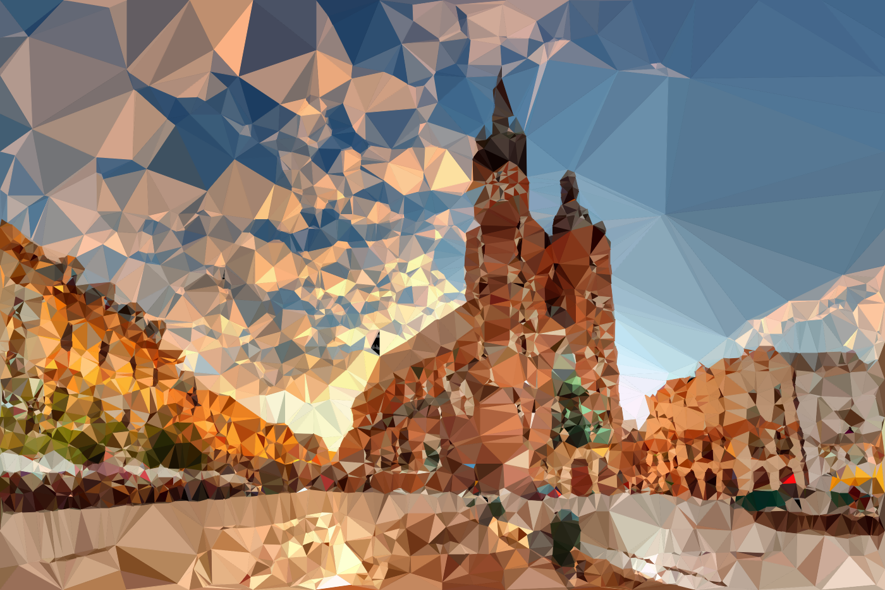
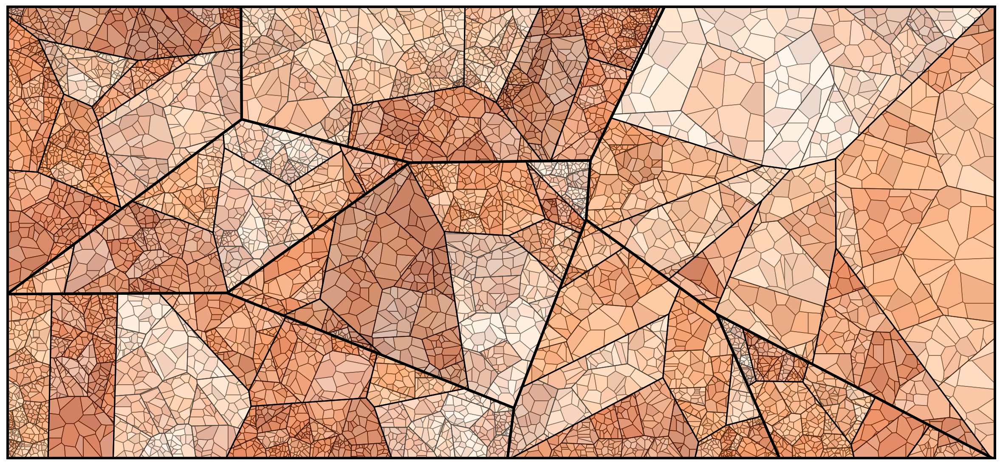

### Playing with **voronois**

> In mathematics, a **Voronoi** diagram is a partitioning of a plane into regions based on 
> distance to points in a specific subset of the plane. That set of **points** (called seeds, 
> **sites**, or generators) is specified beforehand, and for each seed there is a corresponding 
> **region** consisting of **all points closer to that seed than to any other**. These regions are 
> called Voronoi **cells**. The Voronoi diagram of a set of points is dual to its Delaunay triangulation.

### Voronoi example

### Worlds airports

### Voronoi **triangulation**

**Triangulated** using `D3.voronoi` and Delaunay triangulation

### More **Voronoi**: Stained glass
  
