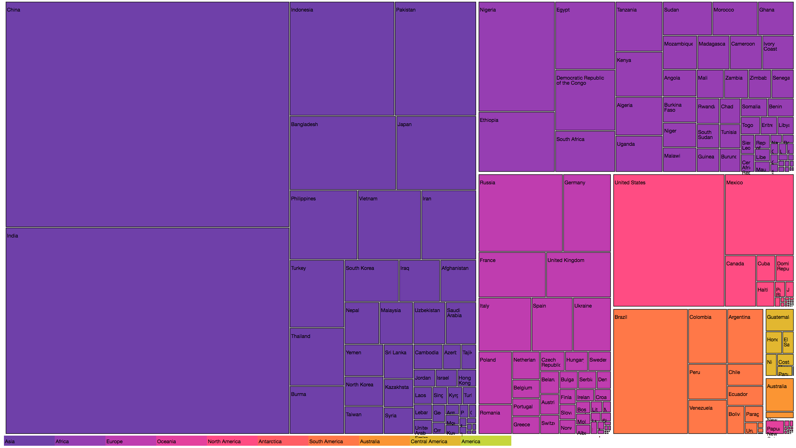
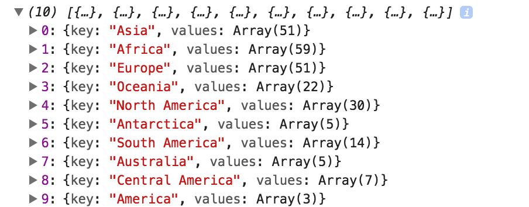
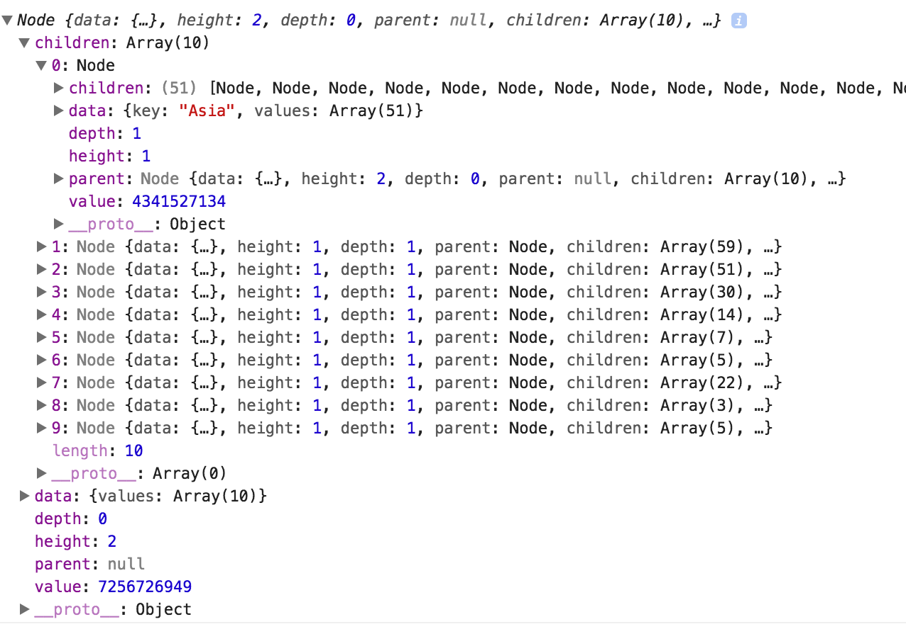
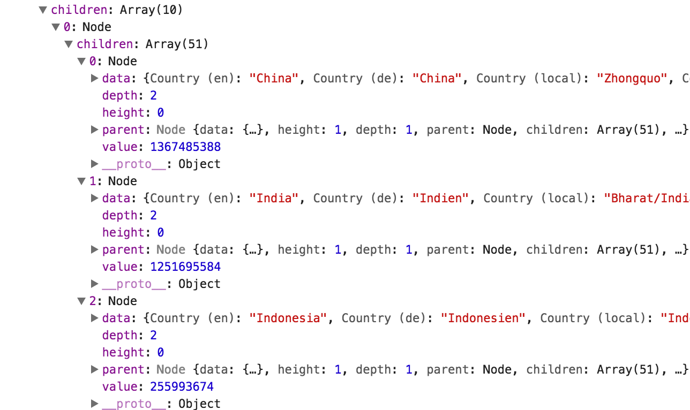
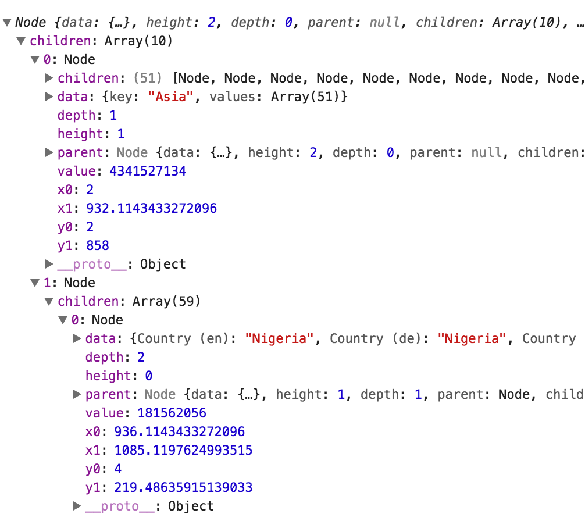
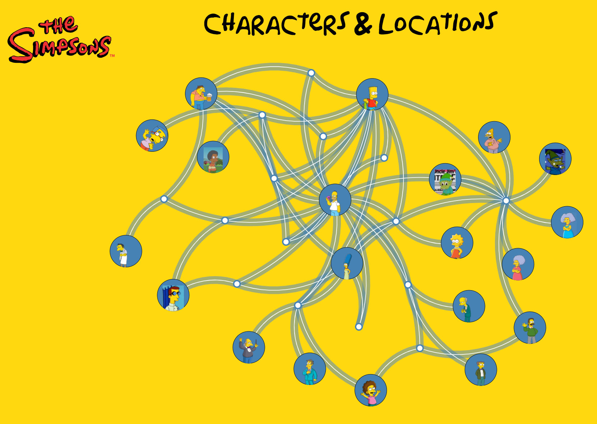
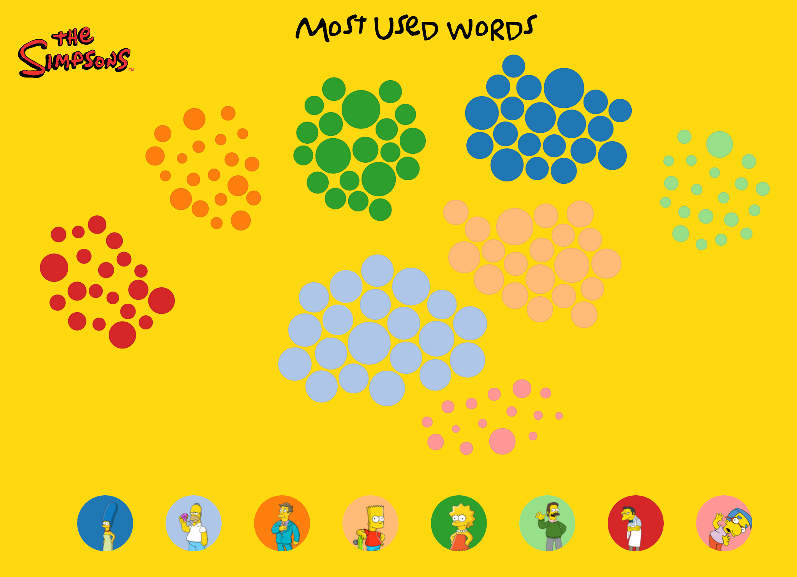
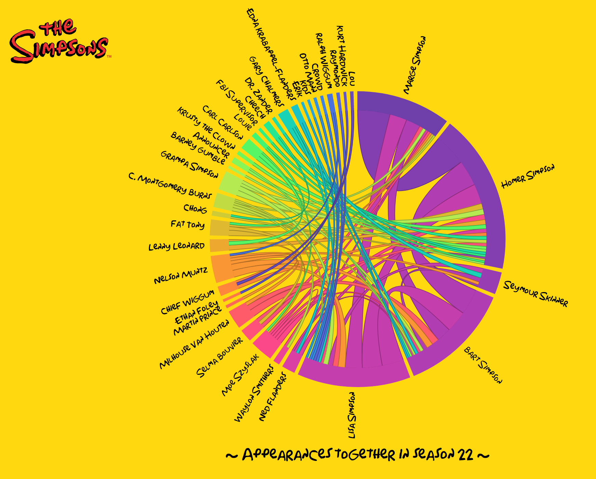
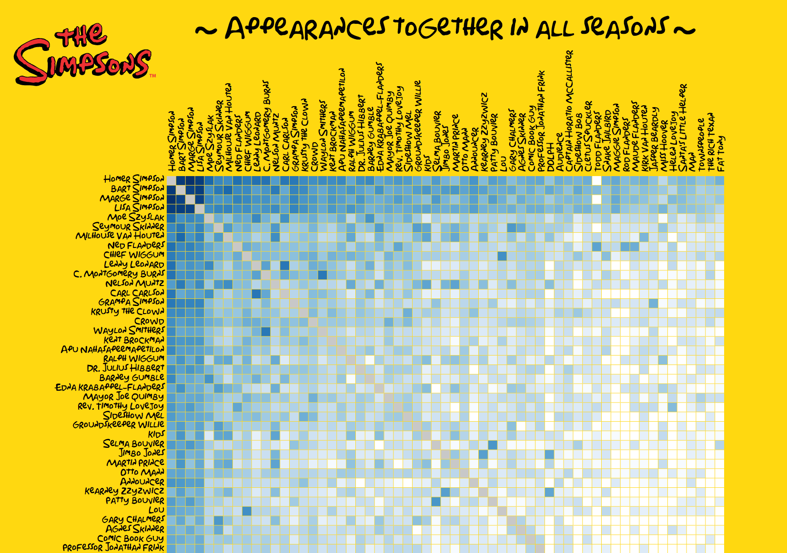

### Layouts

> With **generator**s we generate **path** attributes, which we can position ourselves. With
> a layout we can have D3 determine the **correct positions** of our elements, and we only 
> have to determine how to visualize them.


### D3 and layouts

- D3 comes with a standard set of layouts: **Chord**, **Force**, **Cluster**, **Tree**, **Treemap**, **Partion**, **Pack**
- Except **Chord** and **Force** all follow the same pattern (more on this later)

[Radial Tree Layout](http://localhost/dev/git/dataviz-d3js/src/chapter-03/D03-02.html) <!-- .element: target="_blank" -->


### Basic Layout pattern

1. Load the data (`d3.csv`,`d3.tsv`,`d3.json` etc.)
2. If necessary, convert it to a nested structure
  - D3 has helpers: `d3.stratisfy`, `d3.nest`
3. Convert the nested data into the required stucture (`d3.hierarchy`)
4. Pass it through a generator (e.g `Tree`)
5. Use the output from the generator to draw elements 


### Lets create a **TreeMap**

 

[Sample treeMap](http://localhost/dev/git/dataviz-d3js/src/chapter-03/D03-03.html) <!-- .element: target="_blank" -->


### Step 1: load the data

```
"Country (en)";"Country code";"Continent";"Population";"Area";
"Afghanistan";"AF";"Asia";32564342;652230;0;
"Egypt";"EG";"Africa";88487396;1001450;2450;
..
```

```
d3.text('./data/countries.csv', function(raw) {
  var data = d3.dsvFormat(";").parse(raw)
  ... // do some data cleanup
```


### Step 2: convert to **nested**

```javascript
// group entries using nest and create hierarchy per continent
var entries = d3.nest()
              .key(function (d) {return d.Continent; })
              .entries(data);
// and create a root node
var source = { values: entries }
```

 


### Step 3: convert to **hierarchy**

```javascript
// use our nested data, and tell d3 that the 
// children can be accessed through the values property
var root = d3.hierarchy(source, function(d){return d.values;})
    // Count the populations to create the hierarchy
    .sum(function(data) { return data['Population']; })
    // sort the hierarchy based on value
    .sort(function(a, b) { return b.value - a.value; });
```
<div>
<div class="left">

</div>
<div class="right"> 

</div>
<div> 


### Step 4: Enhance with the **treemap** layout

```javascript
var tree = d3.treemap().size([width, height]).padding(2)
tree(root);
```



### Step 5: **select**/**add**/**update**/**remove**

```javascript
// leaves is returns all the elements in an array
var countries = chart.selectAll(".node")
    .data(root.leaves(), function(d) {return d.data.id})

// append a rectangle for each group and set the color
var newCountries = countries.enter().append("rect")
    .style("fill", function(d) {return colorScale(d.parent.data.key)})
    .style("stroke", "black").attr("class","node")
    .on("click", onclick)
    
// merge two selections for common functionality
var allGroups = countries.merge(newCountries);

// Step 6. Create a transition in which we update the x, y, widht and height
// of the rectangles based on the d.x0, d.x1, d.y0 and d.y1 values.
allGroups.transition().duration(2000)
    .attr("x", function(d) {return d.x0}).attr("y", function(d) {return d.y0})
    .attr("width", function(d) {return d.x1 - d.x0})
    .attr("height", function(d) {return d.y1 - d.y0});
```
<!-- .element: style="font-size: 0.35em" -->

[Result](http://localhost/dev/git/d3-exercises/src/exercise-05/E05.html) <!-- .element: target="_blank" -->


### Sidenote: Force layout with links and nodes



[Force layout 1](http://localhost/dev/git/dataviz-d3js/src/chapter-04/D04-01.html) <!-- .element: target="_blank" -->


### Sidenote: Force layout with just nodes



[Force layout 2](http://localhost/dev/git/dataviz-d3js/src/chapter-04/D04-02.html) <!-- .element: target="_blank" -->


### Sidenote: Matrix data with Chord



[Chord Layout](http://localhost/dev/git/dataviz-d3js/src/chapter-04/D04-03.html) <!-- .element: target="_blank" -->


### Sidenote: Matrix data with table



[Custom Layout](http://localhost/dev/git/dataviz-d3js/src/chapter-04/D04-04.html) <!-- .element: target="_blank" -->

