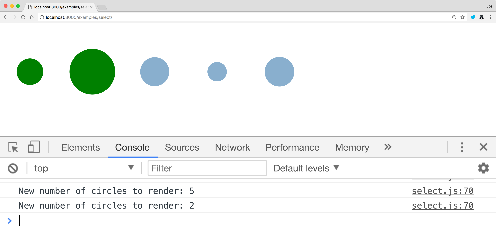

### Select / add / update / remove

> **Select** elements from the DOM, and bind data to them. If we have
> too little elements, **add** new ones. **Update** the datum bound to
> the existing ones, and **remove** elements, for which we don't have
> **data** ony more.


### Pattern in Action



[Select / add / update / remove](./examples/select-transitions) <!-- .element: target="_blank" -->


### Sidestep: **HTML** Setup

```
<html>
<head>
    <script src="../../libs/d3.v4.js"></script>
    <script src="./js/select.js"></script>
    <link rel="stylesheet" href="./css/style.css" type="text/css">
</head>
<body>
<div id="output"><svg class="chart"></svg></div>
<script>
    (function() { show(); })();
</script>
</body>
</html>
```


### Sidestep: **Javascript** Setup

``` 
function show() {

    var margin = { top: 20, bottom: 20, right: 40, left: 40 },
        width = 800 - margin.left - margin.right,
        height = 400 - margin.top - margin.bottom;

    var chart = d3.select(".chart")
        .attr("width", width + margin.left + margin.right)
        .attr("height", height + margin.top + margin.bottom)
        .append("g")
        .attr("transform", "translate(" + margin.left + "," + margin.top + ")");

    function update() { ... }
    
    update();
    d3.interval(function() { update(); }, 5000);   
}
```
<!-- .element: style="font-size: 0.4em" -->

We'll fill in the update function


### **Step 0**: The data we're working with

- Data is a just an array: `[]`
- We'll use sample data:
  - `1` to `10` elements
  - each element random value `20` to `40`
- Handled in this example by `getRandomData()`

```
val data = [26.23690455102537, 25.132792981537815, 
            34.363197598539266]
``` 


### **Step 1**: Select and bind data

- Select and bind data:
```
var circles = chart.selectAll('circle')
    .data(getRandomData())
```
- Bind data to a selection with `data`
  - By default bound on array index.
  - Can be bound on property of data.

- Select with `d3.select` or `d3.selectAll`
 


### **Step 2**: Handle new elements

```javascript
var circles = chart.selectAll('circle')
    .data(getRandomData())
```

- **circles** is `<` bound `data`
  - Use `enter()` to create new `circle`s  
```    
circles.enter().append('circle')
    .attr("r", function(d) { return d })
    .attr("cx", function(d, i) { return i * 100})
    .attr("class", "added")
    .attr("cy", "50")
```

- Set with:`attr(..)`, `style(..)`, `html(..)`, `text(..)` and `classed(..)` 


### **Step 3** and **4**: Update and remove existing elements

- Update the data elements bound to existing **circle**s
```javascript
// set the class to updated and update radius
circles.attr("class", "updated")  
       .attr("r", function(d) { return d })
```  
- Remove the circles without bound data
```
circles.exit().remove();
```

[~ And with that ~](./examples/select) <!-- .element: target="_blank" -->


### Sidestep: **Transitions** 

- Interpolate change on a selection
```javascript
// contains the circles, which are being reused
circles.attr("class", "updated")
       .transition().duration(2000)  
       .attr("r", function(d) { return d })
```
- Works out of the box for:
  - `number`, `color`
  - `string`: finds numbers in the string
- Custom using: `attrTween` or `styleTween`
- https://github.com/d3/d3-transition


### Databinding on index

```javascript
var input = [ 
{id: 3, value: 22.63978478623312}
{id: 6, value: 23.562434755740533}
{id: 8, value: 23.82717533064451}];

var circles = chart.selectAll('circle').data(input
   , function(d) {return d.id});
```
- With `data` we can provide an accessor function.
- Data is now bound and updated on `d.id` 
- E.g useful for sorting and moving elements


#### Code: **Pattern**, **Transitions** and **data binding**

```javascript
   var circles = chart.selectAll('circle')
       .data(getRandomData(), function(d) {return d.index});
  
   circles.enter().append('circle').attr("class", "added")
       .attr("cy", "50")
       .transition().duration(2000)
       .attr("cx", function(d, i) { return i * 100})
       .attr("r", function(d) { return d.value });
  
   circles
       .attr("class", "updated")
       .transition().duration(2000)
       .attr("cx", function(d, i) { return i * 100})
       .attr("r", function(d) { return d.value });
  
   circles.exit()
       .transition().duration(2000)
       .attr("r", 0).style("opacity", 0)
       .on('end', function(d) { this.remove() });
``` 
<!-- .element: style="font-size: 0.4em" -->

[~ End of pattern 1 ~](./examples/select-transitions-all) <!-- .element: target="_blank" -->
